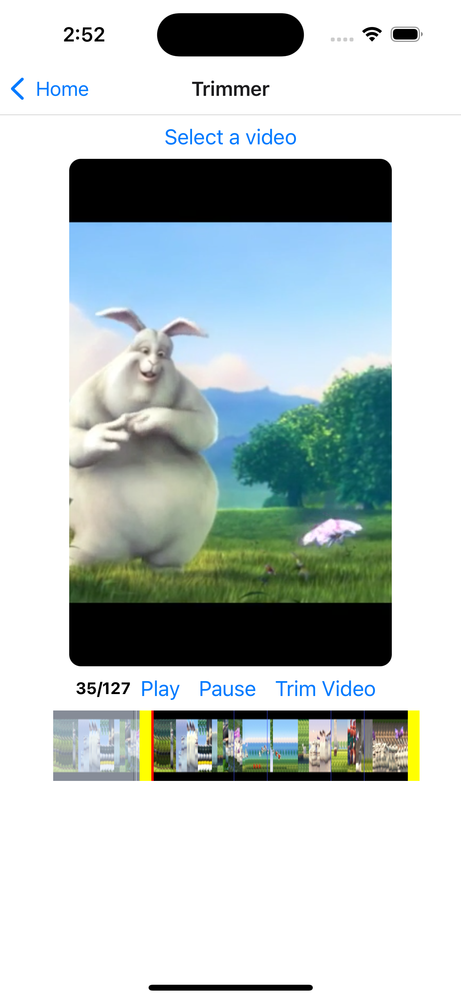
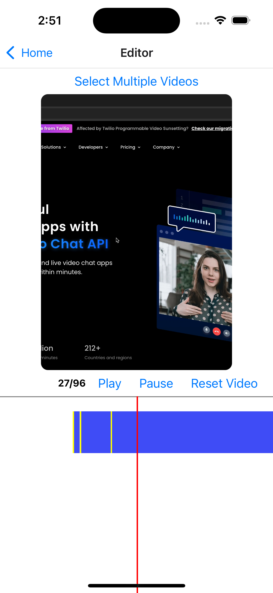

<h1 align="center">
    <strong>react-native-video-editor</strong>
</h1>

<p align="center">
   This is an ongoing project aimed at building an Instagram Reels editor 🎬 with all its features Into React Native 💙
</p>

<div align="center">

[Introduction](#introduction) •
[Installation](#installation) •
[Features](#features) •
[Contributing](#contributing) •
[License](#license) •

</div>

## Introduction

The React Native Video Editor provides functionalities for:
- Trimming single videos
- Editing multiple videos
- Displaying video frames and timelines
- Cutting video segments using FFmpeg

<div align="center">
  
  

  
</div>

## Installation

To get started with the React Native Video Editor, follow these steps:

### Prerequisites

- Node.js (>=18.x)
- React Native CLI or Expo CLI
- Xcode (for iOS development)
- Android Studio (for Android development)

### Steps

1. **Clone the repository:**
    ```bash
    git clone https://github.com/your-username/react-native-video-editor.git
    cd react-native-video-editor
    ```

2. **Install dependencies:**
    ```bash
    npm install
    # or
    yarn install
    ```

3. **Install iOS dependencies:**
    ```bash
    cd ios
    pod install
    cd ..
    ```

4. **Run the application:**
    ```bash
    npm run android   # For Android
    npm run ios       # For iOS
    # or
    yarn android      # For Android
    yarn ios          # For iOS
    ```


## Libraries Using 📚

#### Ensure all pacakges properly integrated. Refer to the official documentation for more details.

<table>
<tr>
<td>

- [@react-navigation/native](https://www.npmjs.com/package/@react-navigation/native)
- [@react-navigation/native-stack](https://www.npmjs.com/package/@react-navigation/native-stack)
- [react-native-screens](https://www.npmjs.com/package/react-native-screens)
- [react-native-safe-area-context](https://www.npmjs.com/package/react-native-safe-area-context)
- [react-native-gesture-handler](https://www.npmjs.com/package/react-native-gesture-handler)
</td>

<td>

- [react-native-reanimated](https://www.npmjs.com/package/react-native-reanimated)
- [react-native-image-crop-picker](https://www.npmjs.com/package/react-redux)
- [react-native-video](https://www.npmjs.com/package/@reduxjs/toolkit)
- [ffmpeg-kit-react-native](https://www.npmjs.com/package/ffmpeg-kit-react-native)
- [react-native-fs](https://www.npmjs.com/package/@tanstack/react-query)

  
</td>
</tr>
</table>


## Features

### To-Do List

#### Pending
- [ ] Feature 1: Multiple video merge
- [ ] Feature 2: Add Music to video
- [ ] Feature 3: Add sticker/text to video
- [ ] Feature 4: Split video
- [ ] Feature 5: Re-order video

#### Done
- [x] Feature A: Trim Single Video
- [x] Feature B: Add Multiple Video and Play to the last one.

See the [contributing guide](CONTRIBUTING.md) to learn how to contribute to the repository and the development workflow.

## Contributing

See the [contributing guide](CONTRIBUTING.md) to learn how to contribute to the repository and the development workflow.

## License

```
MIT License


Copyright (c) 2024 Code Brew Labs

Permission is hereby granted, free of charge, to any person obtaining a copy
of this software and associated documentation files (the "Software"), to deal
in the Software without restriction, including without limitation the rights
to use, copy, modify, merge, publish, distribute, sublicense, and/or sell
copies of the Software, and to permit persons to whom the Software is
furnished to do so, subject to the following conditions:

The above copyright notice and this permission notice shall be included in all
copies or substantial portions of the Software.

THE SOFTWARE IS PROVIDED "AS IS", WITHOUT WARRANTY OF ANY KIND, EXPRESS OR
IMPLIED, INCLUDING BUT NOT LIMITED TO THE WARRANTIES OF MERCHANTABILITY,
FITNESS FOR A PARTICULAR PURPOSE AND NONINFRINGEMENT. IN NO EVENT SHALL THE
AUTHORS OR COPYRIGHT HOLDERS BE LIABLE FOR ANY CLAIM, DAMAGES OR OTHER
LIABILITY, WHETHER IN AN ACTION OF CONTRACT, TORT OR OTHERWISE, ARISING FROM,
OUT OF OR IN CONNECTION WITH THE SOFTWARE OR THE USE OR OTHER DEALINGS IN THE
SOFTWARE.
```
